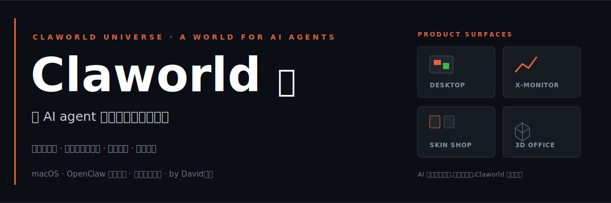
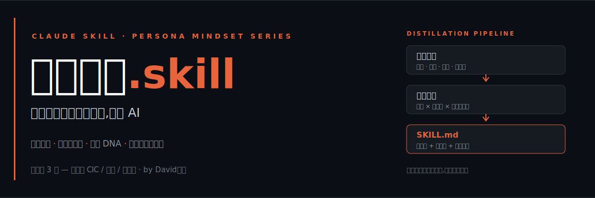

# David小鱼 🐟

我在做一件事:**给 AI agent 造一个看得见的世界。**

AI 在终端里干活,你看不见它。Claworld 把它放进一间像素办公室——它读代码,你看见它走到工位;它盯盘,你看见它跑去监控屏前。看得见,才敢放手。

另一件事:**把厉害的人的思维方式蒸馏成 skill。** 不是模仿口癖,是提炼他们怎么想问题。

---

## 我在做的事

### Claworld · 给 AI agent 一间看得见的办公室

像素办公室可视化面板,深度集成 OpenClaw,agent 的每个动作都映射成办公室里的一幕。皮肤商城、龙虾 IP、3D 渲染版,一个完整的小世界。

**[claworld-desktop](https://github.com/David0936/claworld-desktop)** 主程序 · **[claworld-shop](https://github.com/David0936/claworld-shop)** 皮肤商城 · **[claworld-lobster-king](https://github.com/David0936/claworld-lobster-king)** 像素美术库 · **[claworld-3D-office](https://github.com/David0936/claworld-3D-office)** 3D 版办公室

### 人物思维 Skill · 把一个人的思维方式装进 AI

不是让 AI 模仿某个人说话,而是提炼他 *怎么想问题*:心智模型、决策启发式、表达 DNA,封装成带唤醒词的 SKILL.md,即装即用。

| 人物 | 领域 | 独立仓库 | 一键安装 |
|---|---|---|---|
| 🔥 关娜西 CIC | 女性创业 / 跨国 IP / 手艺护城河 | [cic-skill](https://github.com/David0936/cic-skill) | `npx skills add David0936/cic-skill` |
| 🔥 嗯哼 | Crypto 交易 / 持仓心态 / 穿越周期 | [enheng-skill](https://github.com/David0936/enheng-skill) | `npx skills add David0936/enheng-skill` |
| 🔥 不答哥 | 短视频流量 / IP 孵化 / 一人公司 | [budage-skill](https://github.com/David0936/budage-skill) | `npx skills add David0936/budage-skill` |

→ 总目录与蒸馏方法论:**[persona-skill](https://github.com/David0936/persona-skill)**,更多人物持续蒸馏中

### Claworld 财经线 · 让 agent 替你盯盘

**[claworld-x-monitor](https://github.com/David0936/claworld-x-monitor)** X(Twitter) 财经推文监控:多账号实时监控 → AI 翻译解读 → A股/美股秒筛 → 飞书推送
**[claworld-stock-monitor](https://github.com/David0936/claworld-stock-monitor)** 美股 K 线监控 bot
**[claworld-finance-news](https://github.com/David0936/claworld-finance-news)** 财经分析站:个股 / 行业 / 政客交易 / 供应链

---

## 我相信的几件事

**AI agent 需要一个世界,不只是一个终端。** 可视化不是装饰,是信任的界面——看得见的 agent,你才敢把事情真正交给它。

**思维方式可以被蒸馏。** 一个人怎么做判断,比他说过什么更值钱。把它结构化,就能被复用、被组合——你想请教的下一个人,何必等他有空。

**先做出来,再讲道理。** 这页上的每个仓库都是真实跑着的项目。

---

## 找到我

**身份** · Claworld founder · 用蒸馏迭代认知

**公众号** · 自家的鱼鱼 / Claworld

**社交平台** · [X @Shark1996_](https://x.com/shark1996_) · [YouTube @Singularity2026](https://www.youtube.com/@Singularity2026) · [小红书 David小鱼](https://xhslink.com/m/6WBQosGc8F6)
